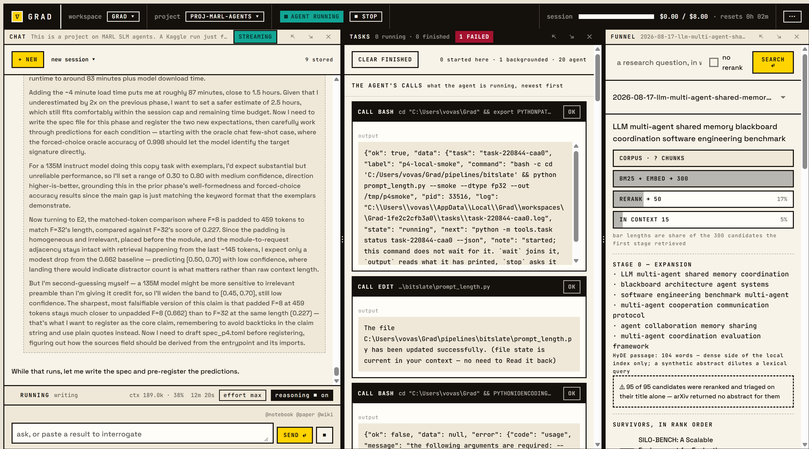
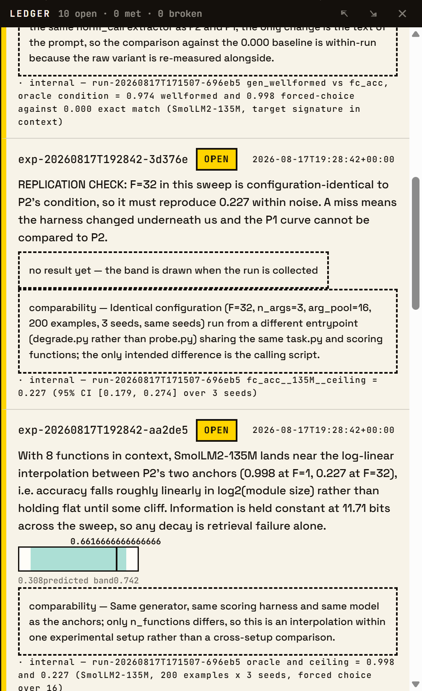
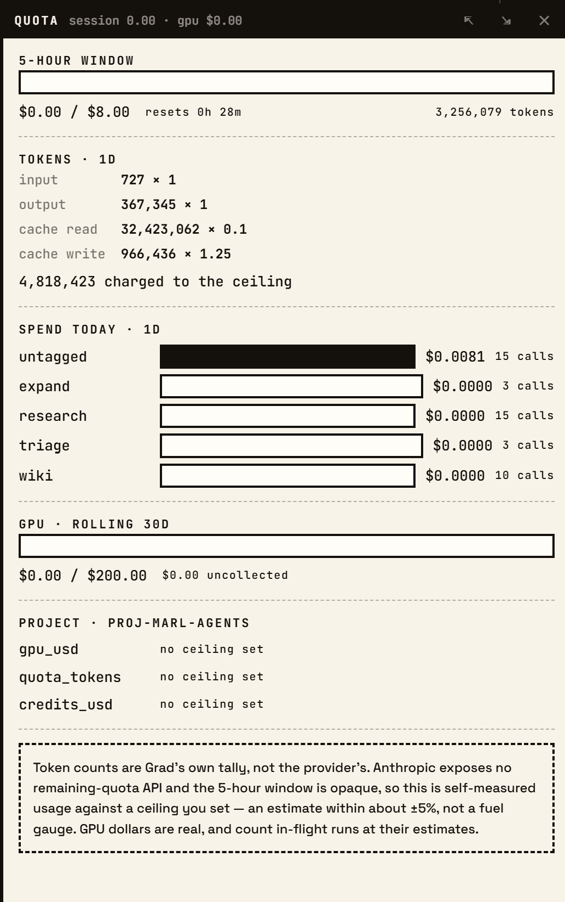
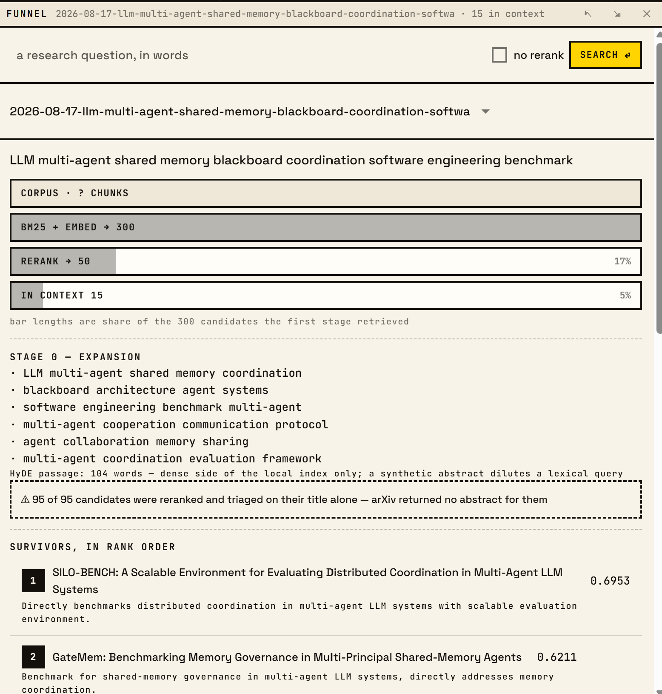

<h1 align="center">Grad</h1>

<p align="center"><b>A research harness for machine learning, built on the Claude Agent SDK.</b></p>

<p align="center">
  
  
  
  
</p>

<p align="center">
  
</p>

Grad is Claude Code pointed at research work, with the rest of a research
project built around it. The loop is the one you already use — one model, six
tools, files on disk. What is added is the apparatus a paper needs and a chat
window does not: a literature funnel, a ledger of predictions and outcomes,
mechanical guards in front of anything that spends money, submitters for GPU
backends, and the artifacts at the end.

It is for people who already work with Claude and would rather not keep the rest
of the work in eleven browser tabs and a notes app.

> Grad runs on a **Claude subscription** (Pro or Max) and wants a **Voyage AI
> key** for reranking. Both are covered under [What you need](#what-you-need).
> It is **in active development** — see [Status](#status) before you rely on it.

---

## What it is, precisely

`agent.py` opens a `ClaudeSDKClient` with a small system prompt and six tools —
`Read`, `Write`, `Edit`, `Bash`, `Glob`, `Grep`. Everything Grad adds is a
command-line tool the model reaches over Bash: `--json` on every subcommand, a
stable envelope, and errors that carry the literal next command to run.

That is the whole architectural idea. **Capability is a CLI, not a framework.**
A tool that is a program can be run by the agent, by you, by a test, and by a
background task runner, and it lands in the same ledger every time.

The absences are deliberate too. `Task` is denied, because a subagent is a model
call the main loop never issues and therefore never meters — and metering is the
point. `WebSearch` and `WebFetch` are denied as well: literature comes through
the funnel, where it is ranked, traced and citable, rather than pasted in from a
search result.

### What surrounds the loop

- **Papers in.** A five-stage retrieval funnel — expand → retrieve → rerank →
  triage → select — over Papers with Code and your own local index. arXiv LaTeX
  source is ingested into section-aware chunks; the index is SQLite FTS5 plus
  vectors, fused by reciprocal rank. Every stage writes a trace, so a search you
  disagree with can be inspected rather than re-run.
- **A gate in front of every dollar.** Nothing reaches paid hardware without a
  passing preflight for that exact submission, a pre-registered prediction, room
  under the project's ceiling, and no stale uncollected run. These are programs
  that refuse, not sentences in a prompt.
- **Compute where you have it.** The same verbs — `submit`, `status`, `collect`
  — against Modal (T4 through B200, billed by the second), Hugging Face Jobs, any
  SSH host you can reach, and Kaggle's free GPU/TPU, where an hours-based quota
  is enforced because a dollar ceiling measures nothing.
- **Evidence that outlives the session.** An append-only ledger of expectations
  and results. Replicated runs are compared interval against interval, so
  "matches the prediction" is a statement with a spread behind it.
- **Papers out.** `report draft → write → cite → check → build` produces a LaTeX
  paper whose every number traces to a run record and whose every citation
  resolves to a real document. `check` refuses on a claim you have not judged.
- **A wiki for what got built.** Generated pipeline code, explained — half
  extracted from the source, half written.
- **One workspace.** A tiling desktop app: agent chat, JupyterLab, the ledger,
  the funnel, the queue, quota, preflight, the paper editor.

---

## The workspace

<table>
<tr>
<td width="50%"><br><sub><b>Ledger</b> — each prediction registered before the run, its outcome drawn against the predicted band, and the comparability note saying what would make the two incomparable.</sub></td>
<td width="50%"><br><sub><b>Quota</b> — all four kinds of token, weighted into the one number the ceiling sees, with a standing note that this is a self-measured tally rather than a fuel gauge.</sub></td>
</tr>
</table>

<p align="center">
  
</p>

<p align="center"><sub><b>Funnel</b> — 300 candidates to 50 to 15, the expanded queries that found them, and a warning when the survivors were ranked on titles alone.</sub></p>

The design is deliberate: cream paper, 2px ink rules, monospace for anything the
machine produced, and exactly one accent colour per state — yellow when it needs
you, teal when it passed, red when it broke. Windows tile, split and swap; the
arrangement persists.

---

## What you need

### A Claude subscription

Grad runs on your Claude subscription, not on the Developer Platform. Pro, Max,
Team or Enterprise will all authenticate; **Max is what it was built and
budgeted against**, and Pro will run out sooner than you expect on a long
session.

```bash
npm install -g @anthropic-ai/claude-code   # the SDK spawns this binary
claude setup-token                          # mints the OAuth token
```

`ANTHROPIC_API_KEY` is removed from the process environment at startup, on
purpose: it outranks the OAuth token in the credential chain, and a stray export
would silently bill the API instead of the subscription. **Running Grad on API
credits means editing the code.** `python agent.py --check` reports which
credential it is using and what it removed.

### A Voyage AI key

Retrieval's second stage is a dedicated cross-encoder reranker (`rerank-2.5`),
and the local index is embedded with `voyage-4`. Both are Voyage, both are billed
in credits rather than subscription quota, and both are metered in the same
ledger as everything else.

Without a key, `paper_search --no-rerank` and `paper_ingest --no-vectors` still
run and retrieval falls back to keyword ranking. That is a real drop in quality,
not a shrug — the reranker is what turns 300 plausible titles into 15 papers
worth reading. An OpenRouter key can carry the rerank stage instead; embeddings
have no second rail.

### Optional, one per backend

| Credential | Buys you |
|---|---|
| `hf_token` | Hugging Face Jobs |
| `kaggle_key` + account | free GPU/TPU, rationed by the hour |
| `modal_token_id` + `modal_token_secret` | Modal sandboxes: T4 through B200, by the second |
| SSH host or key | your own box |
| `openrouter_key` | a second rail for reranking |
| `context7_key`, `asta_api_key` | higher rate limits on docs and discovery |

Credentials go to the OS credential store, never into a config file and never
into the agent's environment. The tools that need them shell out, so the secret
enters one child process at the moment of use.

**On a headless host there is no credential store**, which is a normal situation
rather than an exotic one — a GPU box reached over SSH has no D-Bus session, so
`keyring` has no Secret Service to talk to and every read fails. The way through
is to say so explicitly and pass the secrets in the environment instead:

```bash
export GRAD_ALLOW_ENV_CREDENTIALS=1
export GRAD_CLAUDE_OAUTH_TOKEN=...        # GRAD_ + the credential's name, upper-cased
export GRAD_VOYAGE_KEY=...
```

It is off by default because §9's whole argument is that a token in the
environment is a token the agent can read. Turning it on is a deliberate trade
for a machine where the alternative is not authenticating at all. Optional
credentials need none of this: an unreachable store reads as an absent key, so
anonymous retrieval still runs.

---

## Install

**Windows** — the full desktop app, a Start Menu shortcut, no console window:

```powershell
irm https://raw.githubusercontent.com/view321/Grad/main/install.ps1 | iex
```

**Anything else** — the CLI and the browser UI:

```bash
git clone https://github.com/view321/Grad && cd Grad && ./install.sh
```

Or by hand, if you would rather see what happens:

```bash
pip install -e ".[agent,notebook,retrieval,remote,ui,math]"
```

Then store the credentials, either from the app's **setup** window or from a
terminal:

```bash
python -m tools.jobs credential set claude_oauth_token
python -m tools.jobs credential set voyage_key
```

The installer asks for a **workspace** folder separate from the checkout, and
that separation is worth accepting. The installation is code and is replaced by
`grad --update`; the workspace is your ledger, notebooks, notes and figures, and
nothing ever touches it. Keeping them together makes every update a merge whose
conflicts land in an append-only ledger.

---

## A session, end to end

```bash
python -m tools.budget new --id proj-scaling --title "width vs depth" \
    --gpu-usd 50 --quota-tokens 5e6 --credits-usd 10 --use --json
python -m tools.preflight run --spec pipeline/spec.toml --json
python -m tools.ledger expect --task scaling --quantity val_loss@1e9_tokens \
    --low 2.9 --high 3.2 --basis 'arXiv:2001.08361|Fig 3|3.05|1.3B params' --json
python -m tools.kaggle submit --spec pipeline/spec.toml --expect exp-... --json
python -m tools.kaggle collect run-... --json
python -m tools.ledger verdict run-... --quantity val_loss@1e9_tokens \
    --verdict bug --note 'lr schedule off by one step' --json
python -m tools.report check --project proj-scaling --json
```

Skip the preflight or the prediction and `submit` refuses, naming the command you
skipped. Skip the verdict and `report check` refuses. In practice you do not type
any of this — the agent does, and you read what came back.

---

## What it refuses to do

> **Anything that spends money, destroys work, or must be true before the fact is
> enforced mechanically, not by prompt.**

The model is trusted to do research. It is not trusted to remember its own safety
rails at two in the morning with a deadline.

| Thing that must hold | Enforced by |
|---|---|
| Code passes QA before it costs money | the preflight record, keyed by a hash of the exact submission |
| Code runs on the *remote* before a full run | a capped smoke job, folded into that record |
| A prediction exists before the result does | the expectation gate, bound at submit time |
| Results get recorded at all | a stale uncollected run blocks every later submission |
| Cumulative spend stays bounded | actuals for collected runs, estimates for runs in flight |
| A free backend's rationed hours stay bounded too | the same fold over accelerator hours |
| Token spend is bounded, not merely measured | checked before every turn, over all four kinds of token |
| Every number in a report traces to a run record | `report check`, which refuses on an unresolved claim |
| Every citation is a real paper | resolved against the corpus, never against the model's memory |
| A result nobody judged cannot be published | `report check` again |

A usage error, a gate refusal and an upstream failure are three different exit
codes, because the agent should not have to read prose to tell them apart. The
full table, and the reasoning behind every row above, is in
[`CLAUDE_README.md`](CLAUDE_README.md).

---

## The tools

Each is a CLI with `--json` on every subcommand.

| CLI | What it does |
|---|---|
| `paper_search` | the five-stage retrieval funnel |
| `paper_ingest` | arXiv LaTeX → section-aware chunks → the local index |
| `nb` | persistent Jupyter kernel: `exec`, `verify`, `restart` |
| `preflight` | the QA gate, and the record the submitters read |
| `jobs` / `gpu` / `kaggle` / `modal` | the same verbs against four backends |
| `ledger` | `expect`, `query`, `verdict`, `falsify`, `abandon`, `verify` |
| `quota` / `budget` | what was spent, and what may still be |
| `evolve` | evolutionary search as a budgeted campaign |
| `task` / `wakeup` | run something long without holding the turn |
| `report` | `draft`, `write`, `cite`, `check`, `build` |
| `project` / `experiments` | what this project knows; every run ever, across workspaces |
| `docs` | is this library call current? introspection first, then Context7 |
| `wiki` / `projwiki` / `lab` / `traces` | human-facing surfaces |

---

## Status

**Grad is in development, and the honest summary is that the machinery is solid
and the mileage is thin.** It has one author, one machine, and no users but its
author. Treat it as something to run and read rather than something to depend on.

What has run against live services, measured from the ledger it keeps on itself:

- The agent loop, the retrieval funnel end to end (expansion, retrieval,
  reranking and triage), Voyage embeddings, and wiki generation.
- **Kaggle**: fifteen real runs submitted and collected, three of them carried
  through to a recorded verdict against their prediction.

What is implemented, tested and **not yet exercised on live hardware**: the
Hugging Face Jobs and SSH submitters, the evolutionary campaign loop, and the
report generator's model-driven half. They share the gates, the records and the
shapes of the paths that have run, and they fail with actionable errors rather
than tracebacks — but a real credential and a real run are what find the
mismatches.

The test suite runs offline; the network is stubbed by a fixture, because a suite
that reaches the network does not fail, it hangs. The gate tests run against a
real ledger in a temporary workspace, since a mock of a gate proves nothing about
the gate.

```bash
python -m pytest -q
```

Alongside the example-based tests, `tests/property/` generates inputs and checks
rules rather than outputs — a mean lies between the extremes it was taken over, a
rolling spend never falls when a run is submitted, and if the shell would run
`ssh` then the deny list says so. That last one found three bypasses on its first
run, including `( ssh gpu-box nvidia-smi )`: three tokens, no quoting, and the
shortest hole the hook ever had. Mutation testing (`mutmut`) is configured for
the same modules and run by hand rather than in CI. Both are described in
[`docs/testing.md`](docs/testing.md).

Three things to know before trusting it with a budget:

- **Interfaces are not stable.** Ledger fields, exit codes and CLI flags still
  move between releases. There is no deprecation policy yet.
- **The Agent SDK surface is version-sensitive.** Permission-mode names and
  semantics have changed between releases, so run `python agent.py --probe` after
  every SDK upgrade: it attempts a call that should be denied and reports whether
  it was actually denied.
- **Windows is the first-class target.** The native window and the
  notification-area icon are Windows features. Linux and macOS get the CLI and
  the browser UI, and everything that matters — the ledger, the gates, the
  notebooks, the submitters — works there. The credential store is `keyring` and
  is not Windows-only, but a headless host has no backend for it; see
  [What you need](#optional-one-per-backend) for the environment route.
  Linux is covered by CI now, which is how the first three Linux-only defects
  were found — before that it had never been run there at all.

### If you run it

The most useful thing anyone can send right now is **where they stopped** —
[`I ran it — here is how far I got`](https://github.com/view321/Grad/issues/new?template=ran_it.yml).
Nothing has to have broken. "I read this far and did not install it" is a finding
about this page. A project with one author and one machine cannot find the things
that only a second machine has.

Something actually broken goes to the
[bug report form](https://github.com/view321/Grad/issues/new?template=bug_report.yml),
which asks for `grad --check` — a report of booleans and variable names that
carries no credentials. [`CONTRIBUTING.md`](CONTRIBUTING.md) has the rest.

---

## Documentation

| | |
|---|---|
| [`CLAUDE_README.md`](CLAUDE_README.md) | the engineering record: every gate, every decision, and what each one cost to learn |
| [`HANDOFF.md`](HANDOFF.md) · [`HANDOFF-2.md`](HANDOFF-2.md) | the design documents of record |
| [`prompts/system.md`](prompts/system.md) | the entire system prompt — read it, edit it |
| [`skills/`](skills) | workflows loaded on demand, not into the default context |
| [`CONTRIBUTING.md`](CONTRIBUTING.md) | how to report what broke, and what the CI checks before a change lands |

---

## Licence

MIT — see [`LICENSE`](LICENSE).
